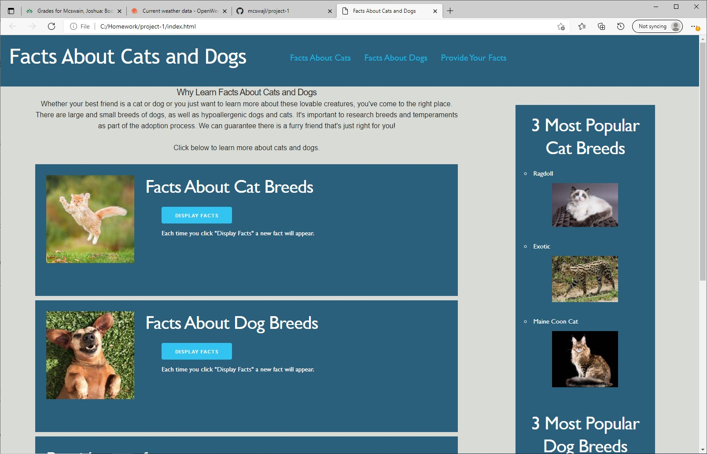
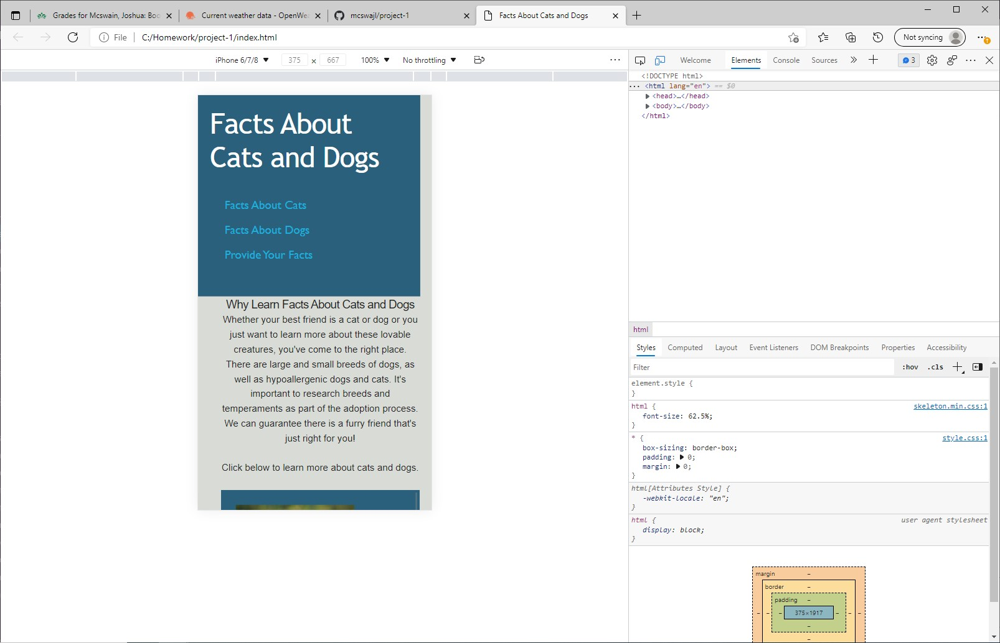

## User Story

AS a researcher looking for some information about random cats or dogs
I WANT to be able to take that information as i please
SO THAT I can work on the project at hand

## Project Criteria

GIVEN I need a website that gives some facts about cats and dogs
WHEN I arrive to said website its clear what its about
THEN I am presented with options as to which animal I want facts about
WHEN I find that section i am given the the option to display some facts
THEN I can either use those facts or proceed to diplay another group of facts
WHEN I am finished gathering the information i need
THEN I am given the option to give feedback

## First row is styled with Skeleton (not bootstrap)

We wanted to create a website that just gives the user some small information about some cats and dogs. 

## Nav bar

We created a nav bar that allows the user to jump from section to section at will.

## Use of two APIs

We then created a display facts section that shoots out random facts about either cats or dogs at will. Everytime you click this button it will give you another random fact.

## Sidebar

We also included a side bar that gives the most popular breeds of both cats and dogs just as an extra fact

## User interaction

We wanted the user to have some form of interaction with our website so we created a section that allows the user to also include their own facts of either cats or dogs.

## Local storage

The information they provide is then stored in local storage

## Media query

Two Skeleton media queries were added to the CSS. One media query is for smaller latops (anything 1300px or less). Second media query is for small phone screens (anything 550px or less).
Both media queries overflow: scroll and the sidebar does not display when media is applied.

## Desktop view of the website

Screenshot of my website

## Phone view of the website

Screenshot of my website

## GitHub and Webpage Links

My webpage URL https://mcswajl.github.io/project-1/

My GitHub URL https://github.com/mcswajl/project-1

## Tools used

html, 
css, 
javascript, 
skeleton, 
GitBash, 
GitHub, 
VScode, 
